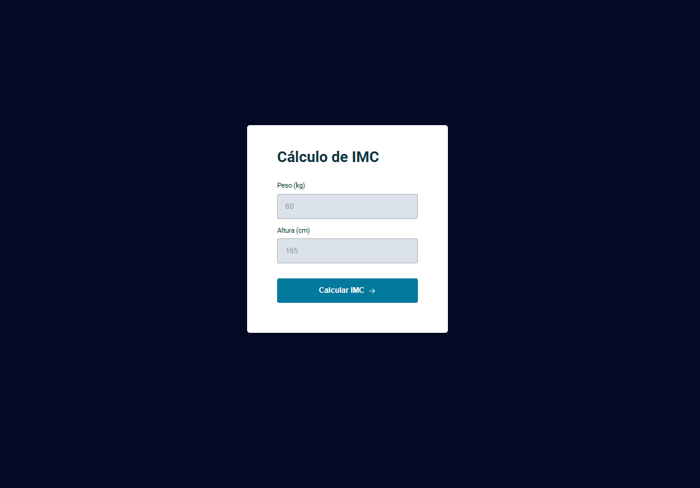
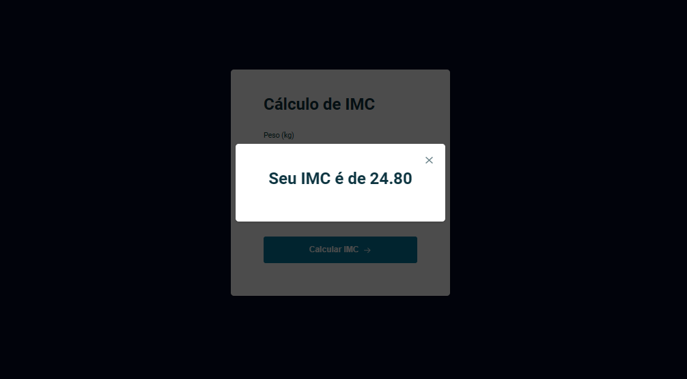

# Cálculo de IMC (índice de massa corporal)
Calcule seu IMC a partir do seu peso e sua altura enrtando pelo link: https://beatriz-gm.github.io/BMI_calculation/

## Preencha os campos abaixo com seus dados:

## E ao clicar no botão, o resultado aparecerá na tela:

## Tecnologias utilizadas:
Figma, HTML, CSS e JavaScript
